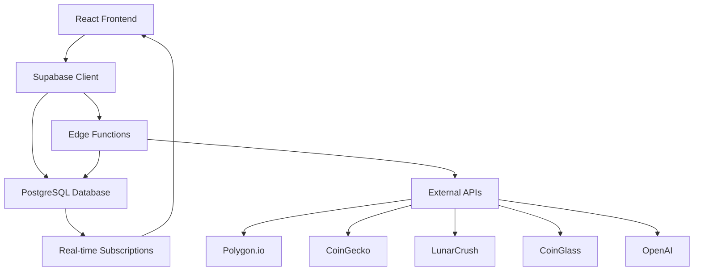
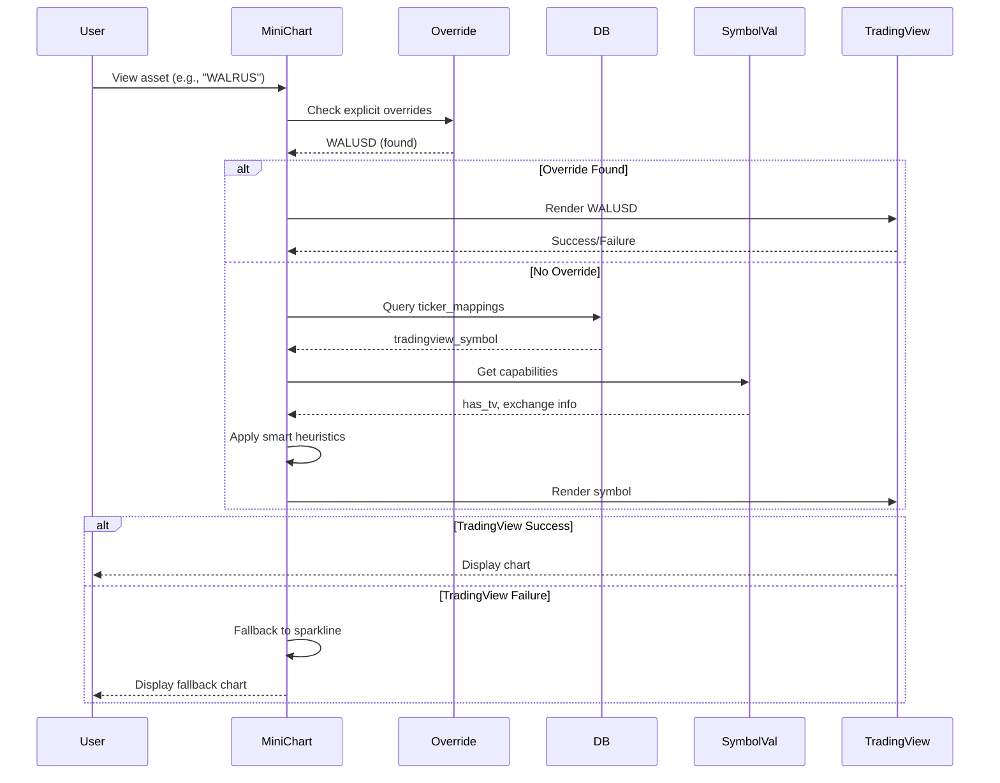
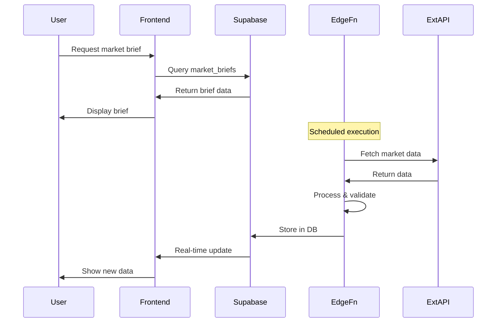

# XRayCrypto™ - Architecture Documentation

## System Architecture Overview

XRayCrypto follows a modern serverless architecture with a React frontend and Supabase backend.



## Frontend Architecture

### Technology Stack
- **React 18**: Modern React with hooks and concurrent features
- **TypeScript**: Type-safe development
- **Vite**: Lightning-fast builds and HMR
- **React Router**: Client-side routing
- **TanStack Query**: Server state management and caching
- **Tailwind CSS**: Utility-first styling
- **shadcn/ui**: High-quality component library
- **Framer Motion**: Smooth animations

### Directory Structure

```
src/
├── components/          # Reusable UI components
│   ├── ui/             # shadcn/ui components
│   ├── XRHeader.tsx    # Global header
│   ├── XRFooter.tsx    # Global footer
│   ├── XRTicker.tsx    # Price ticker
│   ├── Layout.tsx      # Page layout wrapper
│   └── ...             # Feature components
├── pages/              # Page components (routes)
│   ├── Index.tsx       # Home page
│   ├── Markets.tsx     # Market overview
│   ├── News.tsx        # News aggregation
│   ├── MarketBriefHome.tsx  # Brief listing
│   ├── MarketBrief.tsx # Brief detail view
│   ├── Watchlist.tsx   # User watchlists
│   ├── Admin/          # Admin pages
│   └── ...
├── hooks/              # Custom React hooks
│   ├── useLivePrices.tsx     # Live price data
│   ├── useTickerMappings.tsx # Symbol resolution
│   └── use-toast.ts          # Toast notifications
├── integrations/       # External integrations
│   └── supabase/
│       ├── client.ts   # Supabase client config
│       └── types.ts    # Auto-generated DB types
├── lib/                # Utility libraries
│   └── utils.ts        # Helper functions
├── config/             # Configuration files
│   └── tickerMappings.ts  # Symbol mappings
├── index.css           # Global styles & design tokens
└── main.tsx            # App entry point
```

### Key Frontend Patterns

#### 1. **Custom Hooks for Data Fetching**
```typescript
// useLivePrices.tsx - Real-time price updates
export function useLivePrices(tickers: string[]) {
  const [prices, setPrices] = useState<Map<string, PriceData>>();
  
  useEffect(() => {
    // Subscribe to real-time updates
    const subscription = supabase
      .channel('live_prices')
      .on('postgres_changes', ...)
      .subscribe();
    
    return () => subscription.unsubscribe();
  }, [tickers]);
  
  return prices;
}
```

#### 2. **Layout Component Pattern**
```typescript
// Layout.tsx - Provides consistent structure
<Layout>
  <XRHeader />
  <XRTicker />
  {children}
  <XRFooter />
</Layout>
```

#### 3. **Protected Routes**
```typescript
// ProtectedRoute.tsx - Auth guard
<ProtectedRoute requireAdmin={true}>
  <AdminDashboard />
</ProtectedRoute>
```

#### 4. **Symbol Resolution Pattern**
Multi-level priority system for mapping asset symbols to TradingView charts:



**Priority Order**:
1. **Explicit Overrides**: `tickerMappings.ts` and `MarketBriefHome.tsx` (WAL→WALUSD)
2. **Database Mappings**: `ticker_mappings` table with `tradingview_symbol` field
3. **Symbol Capabilities**: From `symbol-validation` edge function (has_tv, coingecko_id)
4. **Local Config**: `tickerMappings.ts` fallback config
5. **Smart Heuristics**: Auto-detection based on symbol format (USD suffix = crypto)

**Edge Function Integration**:
- `symbol-intelligence`: AI-validated symbols feed into the chart system (confidence > 0.8)
- `symbol-validation`: Returns `has_tv`, `tradingview_symbol`, `coingecko_id`, `polygon_ticker`

## Backend Architecture

### Supabase Configuration

**Project ID**: `odncvfiuzliyohxrsigc`
**Region**: Auto-selected based on proximity
**Database**: PostgreSQL 15 with PostGIS extensions

### Database Schema (19 Tables)

#### Core Tables
1. **ticker_mappings**: Symbol resolution and normalization
2. **live_prices**: Real-time price data
3. **market_briefs**: AI-generated daily/weekly briefs
4. **daily_quotes**: Stoic quotes for briefs

#### Data Source Tables
5. **cg_master**: CoinGecko master coin list
6. **poly_tickers**: Polygon stock tickers
7. **poly_fx_pairs**: Forex pairs from Polygon
8. **exchange_pairs**: Crypto exchange trading pairs

#### Social & Sentiment
9. **social_sentiment**: LunarCrush social metrics
10. **market_alerts**: Real-time market alerts

#### News & Content
11. **earnings_calendar**: Stock earnings dates

#### Metadata & Admin
12. **pending_ticker_mappings**: Unresolved symbols for review
13. **missing_symbols**: Tracking unrecognized symbols
14. **market_brief_audits**: Brief validation metrics
15. **quote_library**: Quote database

#### System Tables
16. **cache_kv**: Key-value cache (service role only)
17. **site_settings**: App configuration (service role only)
18. **price_sync_leader**: Leader election for sync jobs
19. **user_roles**: RBAC role assignments

### Edge Functions (11 Functions)

#### 1. **generate-daily-brief**
- **Purpose**: AI-powered market brief generation
- **Triggers**: Scheduled cron + manual
- **Key Features**:
  - Multi-source data aggregation
  - OpenAI GPT-4 analysis
  - Pre-publish validation layer
  - Asset type differentiation
  - Advanced deduplication
  - Audit metrics tracking

#### 2. **polygon-sync**
- **Purpose**: Sync stock ticker data from Polygon
- **Schedule**: Daily
- **Updates**: `poly_tickers`, `poly_fx_pairs`

#### 3. **coingecko-sync**
- **Purpose**: Sync crypto market data
- **Schedule**: Hourly
- **Updates**: `cg_master`, `live_prices`

#### 4. **coingecko-logos**
- **Purpose**: Fetch crypto logos for UI
- **Type**: On-demand
- **Returns**: Logo URLs by CoinGecko ID

#### 5. **news-fetch**
- **Purpose**: Aggregate news from RSS feeds
- **Schedule**: Hourly
- **Sources**: Multiple crypto/finance news sites

#### 6. **symbol-intelligence**
- **Purpose**: AI-powered symbol validation
- **Uses**: OpenAI for symbol recognition
- **Updates**: `pending_ticker_mappings`

#### 7. **symbol-validation**
- **Purpose**: Validate and normalize symbols
- **Type**: On-demand
- **Returns**: Validation results + suggestions

#### 8. **map-polygon-tickers**
- **Purpose**: Map Polygon tickers to internal symbols
- **Type**: Batch processing
- **Updates**: `ticker_mappings`

#### 9. **sync-ticker-mappings**
- **Purpose**: Sync mappings across data sources
- **Schedule**: Daily
- **Updates**: Multiple mapping fields

#### 10. **polygon-price-relay**
- **Purpose**: Real-time stock price updates
- **Type**: WebSocket relay
- **Updates**: `live_prices` table

#### 11. **quotes**
- **Purpose**: Fetch random quote for briefs
- **Type**: On-demand
- **Returns**: Quote text, author, source

### Data Flow Architecture



## Security Architecture

### Authentication
- **Provider**: Supabase Auth
- **Methods**: Email/Password (OAuth ready)
- **Sessions**: JWT tokens with auto-refresh

### Authorization (RBAC)
- **Roles**: admin, moderator, user
- **Storage**: Separate `user_roles` table
- **Function**: `has_role()` security definer function

### Row-Level Security (RLS)
- **Enabled**: All public tables
- **Public Read**: Market data, briefs, prices
- **Private**: User roles, admin tables, cache
- **Service Role**: Full access for edge functions

### Input Validation
- **Client-side**: Zod schemas
- **Server-side**: Database constraints
- **XSS Protection**: DOMPurify sanitization

## Performance Optimizations

### Frontend
- **Code Splitting**: Route-based lazy loading
- **Asset Optimization**: Image lazy loading
- **Caching**: TanStack Query for server state
- **Memoization**: React.memo for expensive components

### Backend
- **Database Indexes**: On frequently queried columns
- **Connection Pooling**: Supabase managed
- **Edge Functions**: Deployed globally via Deno Deploy
- **Cache Layer**: `cache_kv` table for expensive operations

### Real-time Updates
- **Supabase Realtime**: PostgreSQL CDC (Change Data Capture)
- **Selective Subscriptions**: Only subscribe to needed data
- **Debouncing**: Prevent excessive updates

## Deployment Architecture

### Production Environment
- **Frontend**: Lovable hosting (CDN-distributed)
- **Backend**: Supabase cloud (managed PostgreSQL)
- **Edge Functions**: Deno Deploy (global edge network)
- **DNS**: Custom domain support

### CI/CD Pipeline
1. Code pushed to repository
2. Automatic build via Lovable
3. Edge functions deployed automatically
4. Database migrations applied via Supabase CLI
5. Preview deployment for testing
6. Production deployment on approval

## Scalability Considerations

### Current Capacity
- **Database**: Up to 500GB (scalable)
- **Edge Functions**: Auto-scaling
- **Concurrent Users**: 1000+ supported
- **API Rate Limits**: Managed per provider

### Scaling Strategy
- **Horizontal**: Edge functions scale automatically
- **Vertical**: Database can be upgraded
- **Caching**: Expand cache layer for hot data
- **CDN**: Static assets globally distributed

---

**Architecture Type**: Serverless Jamstack
**Database**: PostgreSQL with real-time capabilities
**Deployment**: Managed cloud infrastructure
