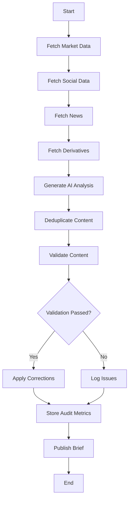

# XRayCrypto™ - Edge Functions Documentation

## Overview

XRayCrypto uses 11 Supabase Edge Functions (Deno-based serverless functions) to handle backend logic, data synchronization, and external API integrations. All functions are deployed automatically via Lovable and run on Deno Deploy's global edge network.

---

## 1. generate-daily-brief

**File**: `supabase/functions/generate-daily-brief/index.ts`

### Purpose
Generate comprehensive AI-powered market briefs (daily or weekly) by aggregating data from multiple sources and using OpenAI GPT-4 for analysis.

### Trigger
- **Cron Schedule**: Daily at 08:00 UTC
- **Manual**: Via admin dashboard
- **API**: POST request with `briefType` parameter

### Data Sources
1. **CoinGecko**: Crypto market data (prices, market caps, volume)
2. **LunarCrush**: Social sentiment and galaxy scores
3. **Polygon.io**: Stock prices and forex data
4. **CoinGlass**: Derivatives and futures metrics
5. **RSS Feeds**: Aggregated news articles
6. **Fear & Greed Index**: Market sentiment indicator

### Process Flow



### Key Functions

#### `fetchMarketData()`
```typescript
// Aggregates top 100 crypto assets by market cap
// Calculates 24h change, volume, price data
// Returns top gainers/losers
```

#### `fetchSocialData()`
```typescript
// Gets LunarCrush social metrics
// Identifies trending assets
// Calculates average galaxy scores
// Returns top social assets
```

#### `generateAIAnalysis()`
```typescript
// Constructs prompt with all aggregated data
// Calls OpenAI GPT-4 API
// Receives 2000-2500 word analysis
// Includes executive summary and detailed sections
```

#### `validateBriefContent()` ✨ NEW
```typescript
// Checks for duplicate content (sentences, phrases, paragraphs)
// Validates asset type classification
// Scans for banned AI phrases
// Auto-corrects detected issues
// Returns validation result + metrics
```

#### `deduplicateContent()`
```typescript
// Removes duplicate sentences (90%+ similarity)
// Eliminates repeated phrases (3+ occurrences)
// Identifies redundant paragraphs
// Context-aware: preserves technical terms
```

### Configuration
```typescript
const CONFIG = {
  dailyBriefLength: 2200,    // Target word count
  weeklyBriefLength: 3500,   // Weekly target
  maxRetries: 3,             // API retry attempts
  timeout: 180000,           // 3 minutes timeout
  validationThreshold: 0.90  // Similarity threshold
};
```

### Response
```json
{
  "success": true,
  "brief_id": "uuid",
  "slug": "daily-brief-2025-01-15",
  "validation": {
    "passed": true,
    "metrics": {
      "total_issues": 12,
      "auto_corrected": 10,
      "critical_issues": 0
    }
  }
}
```

### Error Handling
- API failures: Retry with exponential backoff
- Validation failures: Log but continue with warnings
- Critical errors: Use fallback content
- All errors logged to Supabase for monitoring

---

## 2. polygon-sync

**File**: `supabase/functions/polygon-sync/index.ts`

### Purpose
Synchronize stock ticker data from Polygon.io API to local database.

### Trigger
- **Cron**: Daily at 06:00 UTC
- **Manual**: Admin panel

### What It Syncs
1. **Stock Tickers** (`poly_tickers`)
   - Symbol, name, market
   - Exchange (Nasdaq, NYSE, AMEX)
   - Active status
   - Delisting dates

2. **Forex Pairs** (`poly_fx_pairs`)
   - Currency pair (EUR/USD, GBP/USD, etc.)
   - Base and quote currencies
   - Active status

### Process
```typescript
1. Fetch all active tickers from Polygon API
2. Filter by market (stocks, forex)
3. Upsert into database (insert or update)
4. Mark inactive tickers as delisted
5. Update sync timestamp
```

### Rate Limiting
- **API Limit**: 5 requests/minute (free tier)
- **Handling**: Batching + delays between requests
- **Fallback**: Partial sync if rate limited

---

## 3. coingecko-sync

**File**: `supabase/functions/coingecko-sync/index.ts`

### Purpose
Synchronize cryptocurrency data from CoinGecko API.

### Trigger
- **Cron**: Every hour
- **Manual**: Admin panel

### What It Syncs
1. **Master Coin List** (`cg_master`)
   - CoinGecko ID (unique identifier)
   - Symbol, name
   - Platforms (Ethereum, BSC, etc.)
   - Contract addresses

2. **Live Prices** (`live_prices`)
   - Current price (USD)
   - 24h change %
   - Market cap
   - Volume

### API Calls
```typescript
// Get all coins list
GET /coins/list

// Get market data for top 250
GET /coins/markets?vs_currency=usd&per_page=250

// Get specific coin details
GET /coins/{id}
```

### Optimization
- Batch requests (250 coins per call)
- Cache responses for 5 minutes
- Only update if data changed

---

## 4. coingecko-logos

**File**: `supabase/functions/coingecko-logos/index.ts`

### Purpose
Fetch cryptocurrency logos from CoinGecko for UI display.

### Trigger
- **On-Demand**: Frontend requests
- **Batch**: Multiple logo requests at once

### Input
```json
{
  "coingecko_ids": ["bitcoin", "ethereum", "cardano"]
}
```

### Output
```json
{
  "logos": {
    "bitcoin": "https://assets.coingecko.com/coins/images/1/large/bitcoin.png",
    "ethereum": "https://assets.coingecko.com/coins/images/279/large/ethereum.png",
    "cardano": "https://assets.coingecko.com/coins/images/975/large/cardano.png"
  }
}
```

### Caching
- Logos cached for 24 hours
- Reduced API calls
- Faster page loads

---

## 5. news-fetch

**File**: `supabase/functions/news-fetch/index.ts`

### Purpose
Aggregate financial news from multiple RSS feeds.

### Trigger
- **Cron**: Every hour
- **Manual**: Admin panel

### RSS Sources
```typescript
const feeds = [
  'https://cointelegraph.com/rss',
  'https://www.coindesk.com/arc/outboundfeeds/rss/',
  'https://decrypt.co/feed',
  'https://theblock.co/rss.xml',
  'https://techcrunch.com/feed/',
  // ... more feeds
];
```

### Process
1. Fetch all RSS feeds in parallel
2. Parse XML to extract articles
3. Deduplicate by URL and title similarity
4. Extract entities (Bitcoin, Ethereum, etc.)
5. Sentiment analysis (bullish/bearish/neutral)
6. Store in cache for brief generation

### Entity Extraction
```typescript
// Identifies mentioned assets in article
extractEntities(articleText) {
  // Searches for known ticker symbols
  // Checks against ticker_mappings table
  // Returns array of mentioned assets
}
```

---

## 6. symbol-intelligence

**File**: `supabase/functions/symbol-intelligence/index.ts`

### Purpose
Use OpenAI to intelligently validate and resolve unknown symbols.

### Trigger
- **Automatic**: When unknown symbol detected in brief generation
- **Manual**: Admin panel symbol lookup

### Process
```typescript
1. Receive unknown symbol (e.g., "BTCUSD", "SPY")
2. Query OpenAI with context about symbol
3. AI determines:
   - Asset type (crypto, stock, forex)
   - Correct symbol format
   - CoinGecko ID (if crypto)
   - Polygon ticker (if stock)
   - Display name
   - Confidence score (0-1)
4. If confidence > 0.8, auto-create mapping
5. If confidence < 0.8, add to pending review
```

### OpenAI Prompt
```typescript
const prompt = `
You are a financial symbol expert. Analyze this symbol: "${symbol}"

Context: ${context}

Determine:
1. Asset type (crypto/stock/forex)
2. Correct ticker format
3. Full name
4. Trading platforms/exchanges
5. CoinGecko ID (if crypto)
6. Polygon ticker (if stock)

Return JSON with your analysis and confidence score.
`;
```

---

## 7. symbol-validation

**File**: `supabase/functions/symbol-validation/index.ts`

### Purpose
Validate symbols against known databases without AI (faster than symbol-intelligence).

### Trigger
- **Real-Time**: As symbols are entered
- **Batch**: Bulk validation

### Validation Steps
```typescript
1. Normalize symbol (uppercase, trim, remove special chars)
2. Check ticker_mappings table (exact match)
3. Check ticker_mappings aliases (alternative symbols)
4. Check cg_master (crypto)
5. Check poly_tickers (stocks)
6. Check poly_fx_pairs (forex)
7. Return first match or null
```

### Response
```json
{
  "valid": true,
  "symbol": "BTC",
  "display_name": "Bitcoin",
  "type": "crypto",
  "coingecko_id": "bitcoin",
  "tradingview_symbol": "BINANCE:BTCUSDT"
}
```

---

## 8. map-polygon-tickers

**File**: `supabase/functions/map-polygon-tickers/index.ts`

### Purpose
Map Polygon.io stock tickers to internal ticker_mappings table.

### Trigger
- **Post-Sync**: After polygon-sync completes
- **Manual**: Admin panel

### Process
```typescript
1. Fetch all poly_tickers
2. For each ticker:
   a. Check if already in ticker_mappings
   b. If not, create new mapping with:
      - symbol: Polygon ticker
      - display_name: Company name
      - type: 'stock'
      - tradingview_symbol: Generate TV symbol
      - polygon_ticker: Original Polygon ticker
3. Handle aliases (GOOGL vs GOOG)
4. Mark inactive tickers
```

---

## 9. sync-ticker-mappings

**File**: `supabase/functions/sync-ticker-mappings/index.ts`

### Purpose
Synchronize ticker mappings across multiple data sources (CoinGecko, Polygon, TradingView).

### Trigger
- **Cron**: Daily at 07:00 UTC
- **Manual**: Admin panel

### Sync Logic
```typescript
1. Fetch all ticker_mappings
2. For each mapping:
   a. If coingecko_id exists:
      - Verify it's still active on CoinGecko
      - Update name/symbol if changed
   b. If polygon_ticker exists:
      - Verify it's still active on Polygon
      - Update name if changed
   c. Update tradingview_symbol if needed
3. Create pending mappings for unresolved symbols
```

---

## 10. polygon-price-relay

**File**: `supabase/functions/polygon-price-relay/index.ts`

### Purpose
Real-time stock price relay via Polygon.io WebSocket.

### Trigger
- **WebSocket**: Persistent connection
- **Reconnect**: Auto-reconnect on disconnect

### How It Works
```typescript
1. Connect to Polygon WebSocket
2. Subscribe to stock price updates (trades)
3. On price update:
   a. Normalize data
   b. Upsert into live_prices table
   c. Broadcast to frontend via Supabase Realtime
4. Handle reconnection logic
```

### WebSocket Events
- `T`: Trade (price update)
- `Q`: Quote (bid/ask)
- `A`: Aggregate (OHLCV)

---

## 11. quotes

**File**: `supabase/functions/quotes/index.ts`

### Purpose
Fetch random stoic quote for market briefs.

### Trigger
- **On-Demand**: During brief generation

### Process
```typescript
1. Query quote_library table
2. Filter by:
   - is_active = true
   - category = 'stoic' OR 'trading'
   - times_used < 10 (rotate quotes)
3. Select random quote
4. Increment times_used
5. Update last_used_at
6. Return quote + author + source
```

### Quote Format
```json
{
  "quote_text": "The impediment to action advances action...",
  "author": "Marcus Aurelius",
  "source": "Meditations"
}
```

---

## Edge Function Best Practices

### CORS Configuration
All functions use consistent CORS headers:
```typescript
const corsHeaders = {
  'Access-Control-Allow-Origin': '*',
  'Access-Control-Allow-Headers': 'authorization, x-client-info, apikey, content-type',
};

// Handle preflight
if (req.method === 'OPTIONS') {
  return new Response(null, { headers: corsHeaders });
}
```

### Error Handling
```typescript
try {
  // Function logic
} catch (error) {
  console.error('Error:', error);
  return new Response(
    JSON.stringify({ error: error.message }),
    { 
      status: 500, 
      headers: { ...corsHeaders, 'Content-Type': 'application/json' } 
    }
  );
}
```

### Authentication
```typescript
// For authenticated endpoints
const authHeader = req.headers.get('Authorization');
if (!authHeader) {
  return new Response('Unauthorized', { status: 401 });
}

const supabase = createClient(
  Deno.env.get('SUPABASE_URL')!,
  Deno.env.get('SUPABASE_SERVICE_ROLE_KEY')!
);
```

### Logging
```typescript
// Structured logging
console.log(`[${functionName}] Starting execution`);
console.log(`[${functionName}] Fetched ${count} items`);
console.error(`[${functionName}] Error:`, error);
```

---

## Configuration Files

### supabase/config.toml

```toml
project_id = "odncvfiuzliyohxrsigc"

[functions.generate-daily-brief]
verify_jwt = false

[functions.polygon-sync]
verify_jwt = false

[functions.coingecko-sync]
verify_jwt = false

# ... all 11 functions configured
```

---

## Monitoring & Debugging

### Viewing Logs
1. Go to Supabase Dashboard
2. Navigate to Edge Functions
3. Click function name
4. View logs tab

### Common Issues

**Rate Limiting**
- Solution: Add delays between requests
- Check API quotas

**Timeout**
- Solution: Increase timeout in config
- Optimize expensive operations

**Memory**
- Solution: Stream data instead of loading all at once
- Clear large variables

---

**Total Functions**: 11
**Languages**: TypeScript (Deno runtime)
**Deployment**: Automatic via Lovable
**Regions**: Global edge network
**Monitoring**: Supabase dashboard + logs
