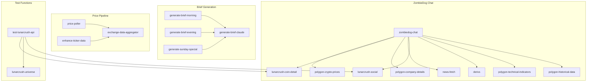

# XRayCrypto™ Edge Functions Audit

**Generated:** 2025-12-31
**Total Functions:** 78

## Summary Statistics

| Metric | Count |
|--------|-------|
| Total Edge Functions | 78 |
| Active (Cron Scheduled) | 35 |
| Active (Frontend Called) | 16 |
| Active (Function Called) | 8 |
| Potentially Orphaned | 19 |
| Test/Debug Functions | 4 |
| Deprecated | 1 |
| One-Time Bootstrap | 4 |

---

## Complete Function Inventory

### Legend
- **Status**: ACTIVE, ORPHANED, TEST, DEPRECATED, BOOTSTRAP, WRAPPER
- **Trigger**: Cron schedule, Frontend call, Function call, Manual only

---

## 🟢 ACTIVE - Cron Scheduled (35 Functions)

These functions run automatically on a schedule and are core to the data pipeline.

| Function Name | Schedule | External API | Tables | Notes |
|---------------|----------|--------------|--------|-------|
| `sync-token-cards-lunarcrush` | `59 1,3,5,7,9,11,13,15,17,19,21,23 * * *` | LunarCrush | token_cards | Full 3000 token sync (12x/day) |
| `sync-token-cards-lunarcrush-tier1` | `*/10 * * * *` | LunarCrush | token_cards | Top 1000 tokens (144x/day) |
| `sync-token-cards-lunarcrush-tier2` | `4,34 * * * *` | LunarCrush | token_cards | Tokens 1001-2000 (48x/day) |
| `sync-token-cards-lunarcrush-tier3` | `45 * * * *` | LunarCrush | token_cards | Tokens 2001-3000 (24x/day) |
| `sync-token-cards-lunarcrush-enhanced` | `18,48 * * * *` | LunarCrush | token_cards | AI summaries, posts, news for top tokens |
| `sync-token-cards-lunarcrush-ai` | `5 */2 * * *` | None (local AI) | token_cards | Generate AI summaries locally |
| `sync-token-cards-polygon` | `* * * * *` | Polygon | token_cards | Polygon prices every minute |
| `sync-token-cards-websocket` | `*/1 * * * *` | Cloudflare Worker | token_cards | WebSocket prices sync |
| `sync-token-cards-coingecko` | `5 2 * * *` | CoinGecko | token_cards | CoinGecko IDs daily |
| `sync-token-cards-coingecko-prices` | `4-59/5 * * * *` | CoinGecko | token_cards | Prices every 5 min |
| `sync-token-cards-coingecko-technicals` | `10 5,11,17,23 * * *` | CoinGecko | token_cards | Technicals 4x/day |
| `sync-token-cards-coingecko-contracts` | `35 6 * * *` | None (DB only) | token_cards | Contract addresses daily |
| `sync-token-cards-metadata` | `20 6 * * *` | CoinGecko | token_cards | Metadata daily |
| `sync-top500-technicals` | `*/30 * * * *` | Polygon | token_cards | Top 500 technicals every 30 min |
| `sync-stock-cards` | `1,11,21,31,41,51 * * * *` | Supabase | stock_cards | Stock data every 10 min |
| `sync-stock-cards-technicals` | `3-58/5 * * * *` | Polygon | stock_cards | Stock technicals every 5 min |
| `sync-stock-cards-52week` | `45 7 * * *` | Polygon | stock_cards | 52-week highs/lows daily |
| `sync-forex-cards-polygon` | `5,20,35,50 * * * *` | Polygon | forex_cards | Forex prices every 15 min |
| `sync-forex-cards-technicals` | `7,22,37,52 * * * *` | Polygon | forex_cards | Forex technicals every 15 min |
| `sync-polygon-crypto-technicals` | `1-58/3 * * * *` | Polygon | token_cards | Crypto technicals every 3 min |
| `polygon-stock-poller` | `1-56/5 * * * *` | Polygon | live_prices | Stock prices every 5 min |
| `polygon-stock-snapshot` | `3-58/5 * * * *` | Polygon | stock_cards | Stock snapshots every 5 min |
| `polygon-company-prefetch` | `15 */4 * * *` | Polygon | company_details | Company details every 4 hours |
| `polygon-news-unified` | `8,23,38,53 * * * *` | Polygon | token_cards, stock_cards, cache_kv | News every 15 min |
| `massive-crypto-snapshot` | `1-59/2 * * * *` | Polygon | crypto_snapshot | Crypto snapshots every 2 min |
| `massive-forex-sync` | `25 3 * * *` | Polygon | forex_cards | Forex sync daily |
| `exchange-data-aggregator` | `5,20,35,50 * * * *` | Multiple exchanges | exchange_ticker_data | Exchange data every 15 min |
| `exchange-sync` | `20 */6 * * *` | Multiple exchanges | exchange_pairs | Exchange pairs every 6 hours |
| `lunarcrush-news` | `12,42 * * * *` | LunarCrush | cache_kv, token_cards | News every 30 min |
| `sync-lunarcrush-topics` | `15,45 * * * *` | LunarCrush | token_cards | Topics every 30 min |
| `warm-derivs-cache` | `4-59/5 * * * *` | CoinGlass | derivatives_cache | Derivatives every 5 min |
| `price-poller` | `2-57/5 * * * *` | exchange-data-aggregator | live_prices | Prices every 5 min |
| `manual-price-sync` | `30 * * * *` | Multiple | live_prices | Fallback price sync hourly |
| `auto-map-polygon-tickers` | `15 2 * * *` | None | polygon_assets | Daily ticker mapping |
| `auto-map-exchange-tickers` | `30 2 * * *` | None | token_cards | Daily exchange mapping |
| `mark-polygon-tokens` | `0 4 * * *` | Polygon | token_cards | Daily WebSocket token marking |

---

## 🟢 ACTIVE - Brief Generation (5 Functions)

| Function Name | Trigger | External API | Tables | Notes |
|---------------|---------|--------------|--------|-------|
| `generate-brief-claude` | Called by wrappers + Admin UI | Anthropic, CoinGecko, LunarCrush, Polygon, Binance | market_briefs | Core AI brief generator |
| `generate-brief-morning` | Cron `0 11 * * *` | None (calls generate-brief-claude) | market_briefs | Wrapper for morning brief |
| `generate-brief-evening` | Cron `0 23 * * *` | None (calls generate-brief-claude) | market_briefs | Wrapper for evening brief |
| `generate-sunday-special` | Cron `0 1 * * 1` | None (calls generate-brief-claude) | market_briefs | Wrapper for Sunday special |
| `generate-og-image` | Frontend (og:image) | None | storage (og-images) | OG image generator |

---

## 🟢 ACTIVE - Frontend Called (16 Functions)

These functions are called directly from the frontend application.

| Function Name | Called From | External API | Tables | Notes |
|---------------|-------------|--------------|--------|-------|
| `zombiedog-chat` | ZombieDogChat.tsx | Anthropic | chat_*, token_cards | Main AI chatbot |
| `zombiedog-agent` | ZombieDogChat.tsx | Anthropic | chat_* | Agentic chatbot |
| `quotes` | InlineQuote, EnhancedBriefRenderer | None | token_cards, live_prices | Quote data for briefs |
| `derivs` | InlineQuote, zombiedog-chat | CoinGlass | derivatives_cache | Derivatives data |
| `lunarcrush-social` | SocialSentimentBoard | None | token_cards | Social sentiment (reads DB) |
| `lunarcrush-universe` | SocialSentimentBoard | None | token_cards | Universe data (reads DB) |
| `lunarcrush-coin-detail` | Token detail, zombiedog-chat | LunarCrush | token_cards | Coin details |
| `get-cached-news` | NewsSection | None | cache_kv | Cached news (read-only) |
| `polygon-crypto-prices` | usePolygonPrices | Polygon | live_prices | Crypto prices |
| `polygon-historical-data` | zombiedog-chat | Polygon | price_history | Historical data |
| `polygon-technical-indicators` | zombiedog-chat | Polygon | None | Technical indicators |
| `polygon-company-details` | Stock detail, zombiedog-chat | Polygon | company_details | Company info |
| `polygon-sparkline-data` | Charts | Polygon | None | Sparkline charts |
| `symbol-validation` | Multiple | None | assets, ticker_mappings | Symbol validation |
| `symbol-intelligence` | EnhancedBriefRenderer, useSymbolValidation | OpenAI | ticker_mappings, pending_ticker_mappings | AI symbol resolution |
| `asset-details` | Token/Stock detail pages | None | Multiple | Asset details aggregator |

---

## 🟢 ACTIVE - Function Called (8 Functions)

These are called by other edge functions.

| Function Name | Called By | External API | Tables | Notes |
|---------------|-----------|--------------|--------|-------|
| `exchange-data-aggregator` | price-poller, enhance-ticker-data | Multiple exchanges | exchange_ticker_data | Price aggregation |
| `polygon-historical-data` | zombiedog-chat | Polygon | price_history | Historical data |
| `polygon-technical-indicators` | zombiedog-chat | Polygon | None | Technicals |
| `polygon-company-details` | zombiedog-chat | Polygon | company_details | Company info |
| `lunarcrush-coin-detail` | zombiedog-chat | LunarCrush | token_cards | Coin details |
| `derivs` | zombiedog-chat | CoinGlass | derivatives_cache | Derivatives |
| `lunarcrush-social` | zombiedog-chat | None | token_cards | Social data |
| `news-fetch` | zombiedog-chat | RSS feeds | news_cache | News aggregation |

---

## 🟡 POTENTIALLY ORPHANED (19 Functions)

These functions exist but appear to have no callers (no cron, no frontend, no function invocations found).

| Function Name | Description | External API | Tables | Recommendation |
|---------------|-------------|--------------|--------|----------------|
| `coingecko-sync` | Sync CoinGecko master list | CoinGecko | cg_master | **MAYBE KEEP** - may be called manually |
| `coingecko-enrich` | Enrich CoinGecko data | CoinGecko | cg_master | **DELETE** - likely replaced by sync-token-cards-coingecko |
| `coingecko-logos` | Fetch CoinGecko logos | CoinGecko | assets | **DELETE** - logos now in token_cards |
| `coingecko-chart-data` | Fetch chart data | CoinGecko | None | **KEEP** - may be used by charts |
| `sync-crypto-mappings` | Sync crypto mappings | None | assets | **DELETE** - replaced by auto-map functions |
| `sync-stock-mappings` | Sync stock mappings | None | assets | **DELETE** - replaced by auto-map functions |
| `sync-ticker-mappings` | Sync ticker mappings | None | ticker_mappings | **DELETE** - old mapping approach |
| `map-polygon-tickers` | Map Polygon tickers | None | ticker_mappings | **DELETE** - replaced by auto-map-polygon-tickers |
| `fix-coingecko-mappings` | Fix CoinGecko mappings | None | coingecko_assets | **DELETE** - one-time fix |
| `migrate-ticker-data` | Migrate ticker data | None | Multiple | **DELETE** - migration complete |
| `enhance-ticker-data` | Enhance ticker data | exchange-data-aggregator | ticker_mappings | **DELETE** - old architecture |
| `calculate-asset-sentiment` | Calculate sentiment | None | asset_sentiment_snapshots | **REVIEW** - may still be useful |
| `market-data` | Market data aggregator | None | Multiple | **DELETE** - replaced by sync functions |
| `polygon-rest-poller` | REST poller | Polygon | live_prices | **DELETE** - replaced by polygon-stock-poller |
| `polygon-raw-preview` | Raw preview | Polygon | None | **DELETE** - debugging tool |
| `polygon-crypto-snapshot` | Crypto snapshot | Polygon | crypto_snapshot | **REVIEW** - called by usePolygonSnapshot hook |
| `backfill-crypto-history` | Backfill history | CoinGecko | price_history | **KEEP** - manual utility |

---

## 🔵 TEST/DEBUG Functions (4)

| Function Name | Description | Recommendation |
|---------------|-------------|----------------|
| `test-polygon-api` | Test Polygon API | **KEEP** - admin diagnostics |
| `test-lunarcrush-api` | Test LunarCrush API | **KEEP** - admin diagnostics |
| `polygon-raw-preview` | Raw API preview | **DELETE** - debugging only |
| `enhance-ticker-data` | JWT protected test | **DELETE** - not used |

---

## 🟣 BOOTSTRAP Functions (4)

One-time setup functions, keep but don't run.

| Function Name | Description | Status |
|---------------|-------------|--------|
| `bootstrap-token-cards` | Initialize token_cards from crypto_snapshot | Complete |
| `bootstrap-forex-cards` | Initialize forex_cards from poly_fx_pairs | Complete |
| `populate-quotes-library` | Populate stoic quotes | Complete (can re-run) |
| `populate-token-addresses` | Populate contract addresses | Complete |

---

## ⚫ DEPRECATED (1)

| Function Name | Replaced By | Status |
|---------------|-------------|--------|
| `news-fetch` | `polygon-news-unified` + `get-cached-news` | Still called by zombiedog-chat - **KEEP FOR NOW** |

---

## Function Dependencies Map

---

## External API Usage Summary

| API | Functions Using | Daily Calls Est. |
|-----|-----------------|------------------|
| **LunarCrush** | 8 functions | ~2,000 |
| **Polygon.io** | 15 functions | ~5,000+ |
| **CoinGecko** | 6 functions | ~1,500 |
| **CoinGlass** | 2 functions | ~300 |
| **Anthropic Claude** | 3 functions | ~20-50 |
| **OpenAI** | 1 function | ~10-20 |
| **Cloudflare Worker** | 1 function | ~1,440 |

---

## Critical Functions (Would Break App if Removed)

1. **`zombiedog-chat`** - Main AI chatbot
2. **`zombiedog-agent`** - Agentic chatbot
3. **`sync-token-cards-*`** (all 10) - Token data pipeline
4. **`sync-stock-cards*`** (all 3) - Stock data pipeline
5. **`sync-forex-cards-*`** (both) - Forex data pipeline
6. **`generate-brief-claude`** - AI brief generation
7. **`quotes`** - Quote data for briefs
8. **`derivs`** - Derivatives data
9. **`get-cached-news`** - News for frontend
10. **`polygon-news-unified`** - News collection

---

## Safe to Delete (19 Functions)

These can be deleted after verification:

1. `coingecko-enrich` - Replaced by sync-token-cards-coingecko
2. `coingecko-logos` - Logos now in token_cards
3. `sync-crypto-mappings` - Old mapping approach
4. `sync-stock-mappings` - Old mapping approach
5. `sync-ticker-mappings` - Old mapping approach
6. `map-polygon-tickers` - Replaced by auto-map-polygon-tickers
7. `fix-coingecko-mappings` - One-time fix complete
8. `migrate-ticker-data` - Migration complete
9. `enhance-ticker-data` - Old architecture
10. `market-data` - Replaced by sync functions
11. `polygon-rest-poller` - Replaced by polygon-stock-poller
12. `polygon-raw-preview` - Debugging only
13. `massive-crypto-snapshot` - **REVIEW**: May still be needed for crypto_snapshot table

---

## Consolidation Opportunities

### 1. LunarCrush Sync Functions (Consider Merging)
Currently have 6 separate functions:
- `sync-token-cards-lunarcrush` (full)
- `sync-token-cards-lunarcrush-tier1`
- `sync-token-cards-lunarcrush-tier2`
- `sync-token-cards-lunarcrush-tier3`
- `sync-token-cards-lunarcrush-enhanced`
- `sync-token-cards-lunarcrush-ai`

**Recommendation**: Keep separate for now - tiered approach is intentional for API budget management.

### 2. Mapping Functions (Definitely Consolidate)
Have multiple old mapping functions that could be removed:
- `sync-crypto-mappings` → DELETE
- `sync-stock-mappings` → DELETE
- `sync-ticker-mappings` → DELETE
- `map-polygon-tickers` → DELETE (replaced by auto-map-polygon-tickers)

### 3. CoinGecko Functions (Review)
- `coingecko-sync` → Keep (master list)
- `coingecko-enrich` → DELETE
- `coingecko-logos` → DELETE
- `coingecko-chart-data` → Keep (charts)
- `sync-token-cards-coingecko` → Keep (token_cards)
- `sync-token-cards-coingecko-prices` → Keep
- `sync-token-cards-coingecko-technicals` → Keep
- `sync-token-cards-coingecko-contracts` → Keep

---

## Cron Schedule Conflicts

No direct conflicts found. Schedules are well-staggered:
- `:00` - sync-token-cards-polygon
- `:01-03` - Various technicals
- `:04-05` - Tier2, CoinGecko prices
- `:07-08` - Forex technicals, news
- `:10` - Tier1
- `:12` - LunarCrush news
- etc.

---

## Answers to Your Questions

### 1. How many total edge functions exist?
**78 functions** (excluding _shared folder)

### 2. How many appear to be orphaned?
**~19 functions** have no clear callers

### 3. Are there any obvious duplicates?
**Yes:**
- `map-polygon-tickers` duplicates `auto-map-polygon-tickers`
- `polygon-rest-poller` duplicates `polygon-stock-poller`
- `sync-crypto-mappings`/`sync-stock-mappings`/`sync-ticker-mappings` - all replaced by auto-map functions
- `coingecko-enrich` replaced by `sync-token-cards-coingecko`

### 4. Which functions are most critical?
1. **zombiedog-chat/agent** - AI chatbot
2. **sync-token-cards-*** - All token sync functions
3. **generate-brief-claude** - AI briefs
4. **quotes/derivs** - Data for briefs
5. **get-cached-news** - News display

### 5. Which functions are safe to delete?
See "Safe to Delete" section above - **~13-19 functions**

### 6. Should any be consolidated?
- **Yes**: Old mapping functions (4) can be deleted
- **Maybe**: CoinGecko functions could be reviewed
- **No**: LunarCrush tiered sync is intentional design

---

## Next Steps

1. **Immediate**: Delete `polygon-raw-preview` (debugging only)
2. **After Testing**: Delete old mapping functions
3. **Review**: Check if `massive-crypto-snapshot` is still needed
4. **Monitor**: Verify `calculate-asset-sentiment` usage
5. **Consider**: Adding health checks for critical functions
