# XRayCrypto System Architecture

**Complete data flow diagram showing all data sources, edge functions, master cards tables, and frontend components.**

---

## 📊 System Architecture Overview

XRayCrypto uses a **Master Cards Architecture** where all market data flows into three central tables:
- `token_cards` - Every crypto token
- `stock_cards` - Every stock
- `forex_cards` - Every forex pair

**One card per asset. All data flows INTO that card. The frontend reads FROM that card.**

---

## 🔄 Complete Data Flow Diagram

```mermaid
graph TB
    subgraph "EXTERNAL DATA SOURCES"
        POLYGON[Polygon.io<br/>Prices, OHLCV, Technicals<br/>Stocks, Forex, News]
        COINGECKO[CoinGecko API<br/>Prices, Market Cap, Supply<br/>Metadata, Contracts, Technicals]
        LUNARCRUSH[LunarCrush API<br/>Social Metrics, Sentiment<br/>AI Summaries, Topics, News]
        RSS[RSS Feeds<br/>22+ Feeds<br/>Crypto, Stock, Trump News]
        WEBSOCKET[Cloudflare Worker<br/>WebSocket Prices<br/>Real-time Updates]
    end

    subgraph "EDGE FUNCTIONS - TOKEN CARDS"
        TF1[sync-token-cards-polygon<br/>Every 1 min]
        TF2[sync-token-cards-websocket<br/>Every 1 min]
        TF3[sync-token-cards-coingecko-prices<br/>Every 5 min]
        TF4[sync-token-cards-coingecko-technicals<br/>4x daily]
        TF5[sync-token-cards-coingecko<br/>Daily 2:05 AM]
        TF6[sync-token-cards-coingecko-contracts<br/>Daily 6:35 AM]
        TF7[sync-token-cards-metadata<br/>Daily 6:20 AM]
        TF8[sync-token-cards-lunarcrush-tier1<br/>Every 10 min]
        TF9[sync-token-cards-lunarcrush-tier2<br/>Every 30 min]
        TF10[sync-token-cards-lunarcrush-tier3<br/>Every 60 min]
        TF11[sync-token-cards-lunarcrush<br/>Every 2 hours]
        TF12[sync-token-cards-lunarcrush-enhanced<br/>Every 4 hours]
        TF13[sync-token-cards-lunarcrush-ai<br/>Every 2 hours]
        TF14[sync-polygon-crypto-technicals<br/>Every 3 min]
        TF15[sync-top500-technicals<br/>Every 30 min]
    end

    subgraph "EDGE FUNCTIONS - STOCK CARDS"
        SF1[sync-stock-cards<br/>Every 10 min]
        SF2[sync-stock-cards-technicals<br/>Every 5 min]
        SF3[sync-stock-cards-52week<br/>Daily 7:45 AM]
    end

    subgraph "EDGE FUNCTIONS - FOREX CARDS"
        FF1[sync-forex-cards-polygon<br/>Every 15 min]
        FF2[sync-forex-cards-technicals<br/>Every 15 min]
        FF3[massive-forex-sync<br/>Daily 3:25 AM]
    end

    subgraph "EDGE FUNCTIONS - NEWS"
        NF1[polygon-news-unified<br/>Every 15 min]
        NF2[news-fetch<br/>RSS Feeds]
        NF3[lunarcrush-news<br/>Every 30 min]
        NF4[get-cached-news<br/>Read-only Cache]
    end

    subgraph "SUPPORTING FUNCTIONS"
        SU1[polygon-stock-poller<br/>Every 5 min]
        SU2[polygon-stock-snapshot<br/>Every 5 min]
        SU3[polygon-company-prefetch<br/>Every 4 hours]
        SU4[exchange-data-aggregator<br/>Every 15 min]
        SU5[exchange-sync<br/>Every 6 hours]
        SU6[auto-map-polygon-tickers<br/>Daily 2:15 AM]
        SU7[auto-map-exchange-tickers<br/>Daily 2:30 AM]
        SU8[mark-polygon-tokens<br/>Daily 4:00 AM]
        SU9[sync-lunarcrush-topics<br/>Every 30 min]
        SU10[sync-lunarcrush-ai-top25<br/>Hourly]
    end

    subgraph "DATABASE - MASTER CARDS"
        TC[(token_cards<br/>Master Table)]
        SC[(stock_cards<br/>Master Table)]
        FC[(forex_cards<br/>Master Table)]
        CACHE[(cache_kv<br/>News Cache)]
        LIVE[(live_prices<br/>Intermediate)]
        COMPANY[(company_details<br/>Stock Metadata)]
    end

    subgraph "FRONTEND COMPONENTS"
        FE1[CryptoUniverseDetail<br/>Token Detail Page]
        FE2[Screener<br/>Token Screener]
        FE3[StockDetail<br/>Stock Detail Page]
        FE4[StockScreener<br/>Stock Screener]
        FE5[ForexDetail<br/>Forex Detail Page]
        FE6[ForexScreener<br/>Forex Screener]
        FE7[NewsSection<br/>News Feed]
        FE8[Markets<br/>Market Overview]
        FE9[Watchlist<br/>User Watchlist]
        FE10[Favorites<br/>User Favorites]
    end

    subgraph "FRONTEND HOOKS"
        HOOK1[useTokenCards<br/>Token Data Hook]
        HOOK2[useStockCards<br/>Stock Data Hook]
        HOOK3[useLivePrices<br/>Real-time Prices]
        HOOK4[useCentralizedPrices<br/>Price Aggregation]
    end

    %% Data Sources to Edge Functions
    POLYGON --> TF1
    POLYGON --> TF14
    POLYGON --> SF1
    POLYGON --> SF2
    POLYGON --> SF3
    POLYGON --> FF1
    POLYGON --> FF2
    POLYGON --> FF3
    POLYGON --> NF1
    POLYGON --> SU1
    POLYGON --> SU2
    POLYGON --> SU3

    COINGECKO --> TF3
    COINGECKO --> TF4
    COINGECKO --> TF5
    COINGECKO --> TF6
    COINGECKO --> TF7

    LUNARCRUSH --> TF8
    LUNARCRUSH --> TF9
    LUNARCRUSH --> TF10
    LUNARCRUSH --> TF11
    LUNARCRUSH --> TF12
    LUNARCRUSH --> NF3
    LUNARCRUSH --> SU9
    LUNARCRUSH --> SU10

    RSS --> NF2

    WEBSOCKET --> TF2

    %% Edge Functions to Database
    TF1 --> TC
    TF2 --> TC
    TF3 --> TC
    TF4 --> TC
    TF5 --> TC
    TF6 --> TC
    TF7 --> TC
    TF8 --> TC
    TF9 --> TC
    TF10 --> TC
    TF11 --> TC
    TF12 --> TC
    TF13 --> TC
    TF14 --> TC
    TF15 --> TC

    SF1 --> SC
    SF2 --> SC
    SF3 --> SC
    NF1 --> SC

    FF1 --> FC
    FF2 --> FC
    FF3 --> FC

    NF1 --> CACHE
    NF2 --> CACHE
    NF3 --> CACHE

    SU1 --> LIVE
    SU2 --> SC
    SU3 --> COMPANY
    SU4 --> LIVE

    %% Database to Frontend
    TC --> FE1
    TC --> FE2
    TC --> FE7
    TC --> FE8
    TC --> FE9
    TC --> FE10
    TC --> HOOK1

    SC --> FE3
    SC --> FE4
    SC --> FE7
    SC --> FE8
    SC --> FE9
    SC --> HOOK2

    FC --> FE5
    FC --> FE6
    FC --> FE8

    CACHE --> FE7
    CACHE --> NF4
    NF4 --> FE7

    LIVE --> HOOK3
    LIVE --> HOOK4

    %% Frontend Hooks to Components
    HOOK1 --> FE2
    HOOK1 --> FE8
    HOOK2 --> FE4
    HOOK3 --> FE1
    HOOK3 --> FE3
    HOOK4 --> FE8

    style TC fill:#e1f5ff
    style SC fill:#e1f5ff
    style FC fill:#e1f5ff
    style POLYGON fill:#fff4e6
    style COINGECKO fill:#fff4e6
    style LUNARCRUSH fill:#fff4e6
    style RSS fill:#fff4e6
    style WEBSOCKET fill:#fff4e6
```

---

## 📋 Complete Cron Schedule Reference

### Token Cards Sync Functions

| Edge Function | Schedule | Frequency | Data Source | Writes To |
|--------------|----------|-----------|-------------|-----------|
| `sync-token-cards-polygon` | `* * * * *` | Every 1 min | Polygon | `token_cards.polygon_*` |
| `sync-token-cards-websocket` | `*/1 * * * *` | Every 1 min | Cloudflare Worker | `token_cards` |
| `sync-token-cards-coingecko-prices` | `4-59/5 * * * *` | Every 5 min | CoinGecko | `token_cards.coingecko_*` |
| `sync-token-cards-coingecko-technicals` | `10 5,11,17,23 * * *` | 4x daily | CoinGecko | `token_cards.coingecko_rsi_*` |
| `sync-token-cards-coingecko` | `5 2 * * *` | Daily 2:05 AM | CoinGecko | `token_cards.coingecko_id` |
| `sync-token-cards-coingecko-contracts` | `35 6 * * *` | Daily 6:35 AM | CoinGecko (DB) | `token_cards.contracts` |
| `sync-token-cards-metadata` | `20 6 * * *` | Daily 6:20 AM | CoinGecko | `token_cards.metadata` |
| `sync-token-cards-lunarcrush-tier1` | `*/10 * * * *` | Every 10 min | LunarCrush | `token_cards.lunarcrush_*` (Top 1000) |
| `sync-token-cards-lunarcrush-tier2` | `4,34 * * * *` | Every 30 min | LunarCrush | `token_cards.lunarcrush_*` (1001-2000) |
| `sync-token-cards-lunarcrush-tier3` | `45 * * * *` | Every 60 min | LunarCrush | `token_cards.lunarcrush_*` (2001-3000) |
| `sync-token-cards-lunarcrush` | `59 1,3,5,7,9,11,13,15,17,19,21,23 * * *` | Every 2 hours | LunarCrush | `token_cards.lunarcrush_*` (All 3000) |
| `sync-token-cards-lunarcrush-enhanced` | `7 */4 * * *` | Every 4 hours | LunarCrush | `token_cards` (Top 25) |
| `sync-token-cards-lunarcrush-ai` | `5 */2 * * *` | Every 2 hours | Local AI | `token_cards.ai_summary` |
| `sync-polygon-crypto-technicals` | `1-58/3 * * * *` | Every 3 min | Polygon | `token_cards.polygon_rsi_*` |
| `sync-top500-technicals` | `*/30 * * * *` | Every 30 min | Polygon | `token_cards.polygon_rsi_*` (Top 500) |

### Stock Cards Sync Functions

| Edge Function | Schedule | Frequency | Data Source | Writes To |
|--------------|----------|-----------|-------------|-----------|
| `sync-stock-cards` | `1,11,21,31,41,51 * * * *` | Every 10 min | Polygon + DB | `stock_cards` |
| `sync-stock-cards-technicals` | `3-58/5 * * * *` | Every 5 min | Polygon | `stock_cards.technical_*` |
| `sync-stock-cards-52week` | `45 7 * * *` | Daily 7:45 AM | Polygon | `stock_cards.52week_*` |

### Forex Cards Sync Functions

| Edge Function | Schedule | Frequency | Data Source | Writes To |
|--------------|----------|-----------|-------------|-----------|
| `sync-forex-cards-polygon` | `5,20,35,50 * * * *` | Every 15 min | Polygon | `forex_cards` |
| `sync-forex-cards-technicals` | `7,22,37,52 * * * *` | Every 15 min | Polygon | `forex_cards.technical_*` |
| `massive-forex-sync` | `25 3 * * *` | Daily 3:25 AM | Polygon | `forex_cards` |

### News Sync Functions

| Edge Function | Schedule | Frequency | Data Source | Writes To |
|--------------|----------|-----------|-------------|-----------|
| `polygon-news-unified` | `8,23,38,53 * * * *` | Every 15 min | Polygon | `stock_cards.top_news`, `cache_kv` |
| `lunarcrush-news` | `12,42 * * * *` | Every 30 min | LunarCrush | `cache_kv`, `token_cards` |
| `news-fetch` | *(Manual/Not in config.toml)* | - | RSS Feeds (22+) + Polygon | `cache_kv` |

### Supporting Functions

| Edge Function | Schedule | Frequency | Data Source | Writes To |
|--------------|----------|-----------|-------------|-----------|
| `polygon-stock-poller` | `1-56/5 * * * *` | Every 5 min | Polygon | `live_prices` |
| `polygon-stock-snapshot` | `3-58/5 * * * *` | Every 5 min | Polygon | `stock_cards` |
| `polygon-company-prefetch` | `15 */4 * * *` | Every 4 hours | Polygon | `company_details` |
| `exchange-data-aggregator` | `5,20,35,50 * * * *` | Every 15 min | Multiple Exchanges | `exchange_ticker_data` |
| `exchange-sync` | `20 */6 * * *` | Every 6 hours | Multiple Exchanges | `exchange_pairs` |
| `auto-map-polygon-tickers` | `15 2 * * *` | Daily 2:15 AM | DB Only | `ticker_mappings` |
| `auto-map-exchange-tickers` | `30 2 * * *` | Daily 2:30 AM | DB Only | `token_cards` |
| `mark-polygon-tokens` | `0 4 * * *` | Daily 4:00 AM | Polygon | `token_cards.polygon_supported` |
| `sync-lunarcrush-topics` | `15,45 * * * *` | Every 30 min | LunarCrush | `token_cards` (Topics) |
| `sync-lunarcrush-ai-top25` | `50 * * * *` | Hourly | LunarCrush | `lunarcrush_ai_summaries` |

---

## 🗄️ Master Cards Tables Structure

### `token_cards` Table

**Primary Key:** `canonical_symbol` (e.g., "BTC", "ETH")

**Data Columns by Source:**

#### Polygon Columns (`polygon_*`)
- `polygon_ticker`, `polygon_supported`
- `polygon_price_usd`, `polygon_change_24h_pct`, `polygon_volume_24h`
- `polygon_rsi_14`, `polygon_sma_20/50/200`, `polygon_macd_*`
- `polygon_price_updated_at`

#### CoinGecko Columns (`coingecko_*`)
- `coingecko_id`, `coingecko_price_usd`
- `coingecko_market_cap`, `coingecko_market_cap_rank`
- `coingecko_circulating_supply`, `coingecko_total_supply`
- `coingecko_ath/atl`, `coingecko_rsi_14`, `coingecko_sma_*`
- `coingecko_price_updated_at`

#### LunarCrush Columns (`lunarcrush_*`)
- `lunarcrush_id`, `galaxy_score`, `alt_rank`
- `social_volume_24h`, `sentiment`, `social_contributors`
- `lunarcrush_price_usd`, `lunarcrush_price_updated_at`

#### Display Columns (Computed)
- `price_usd`, `price_source`, `market_cap`, `market_cap_rank`
- `rsi_14`, `sma_20/50/200`, `change_24h_pct`
- `updated_at`

### `stock_cards` Table

**Primary Key:** `symbol` (e.g., "AAPL", "MSFT")

**Data Columns:**
- Price data: `price_usd`, `open_price`, `high_price`, `low_price`, `close_price`
- Market data: `market_cap`, `volume`, `avg_volume`
- Technicals: `rsi_14`, `sma_20/50/200`, `macd_*`, `technical_signal`
- Social (from LunarCrush): `galaxy_score`, `sentiment`, `social_volume_24h`
- News: `top_news` (JSONB), `top_posts` (JSONB)
- Metadata: `sector`, `industry`, `exchange`, `country`

### `forex_cards` Table

**Primary Key:** `pair` (e.g., "XAUUSD", "EURUSD")

**Data Columns:**
- Price data: `rate`, `bid`, `ask`, `spread_pips`
- OHLCV: `open_24h`, `high_24h`, `low_24h`, `change_24h_pct`
- Technicals: `rsi_14`, `sma_20/50/200`, `macd_*`, `technical_signal`
- Metadata: `base_currency`, `quote_currency`, `is_major`, `is_active`

---

## 📰 News Data Flow

### News Sources

1. **Polygon News API** → `polygon-news-unified`
   - Stock news only (1000 articles)
   - Updates: `stock_cards.top_news` + `cache_kv.polygon_news_unified_cache`
   - Schedule: Every 15 min

2. **LunarCrush News API** → `lunarcrush-news`
   - Crypto news
   - Updates: `cache_kv` + `token_cards`
   - Schedule: Every 30 min

3. **RSS Feeds (22+)** → `news-fetch`
   - Crypto feeds (7): CoinDesk, CoinTelegraph, Decrypt, CryptoNews, Bitcoin Magazine, CryptoPotato, CryptoSlate
   - Stock feeds (8): Reuters, CNBC, Dow Jones, Bloomberg, Yahoo Finance, Financial Times, ZeroHedge, Investing.com
   - Trump feeds (6): Truth Social, Breitbart, Fox News, Daily Wire, Newsmax, OANN
   - Also fetches Polygon news (50 articles)
   - Updates: `cache_kv.news_fetch:v1:limit=100`

### News Cache

- **`get-cached-news`**: Read-only function that merges all news sources
- Frontend calls this function (never calls news APIs directly)
- Merges: `polygon_news_unified_cache` + `news_fetch:v1:limit=100` + LunarCrush news

---

## 🖥️ Frontend Components

### Pages Reading from Master Cards

| Component | Reads From | Purpose |
|-----------|------------|---------|
| `CryptoUniverseDetail` | `token_cards` | Token detail page |
| `Screener` | `token_cards` | Token screener/table |
| `StockDetail` | `stock_cards` | Stock detail page |
| `StockScreener` | `stock_cards` | Stock screener/table |
| `ForexDetail` | `forex_cards` | Forex detail page |
| `ForexScreener` | `forex_cards` | Forex screener/table |
| `NewsSection` | `get-cached-news` → `cache_kv` | News feed |
| `Markets` | `token_cards`, `stock_cards`, `forex_cards` | Market overview |
| `Watchlist` | `token_cards`, `stock_cards` | User watchlist |
| `Favorites` | `token_cards`, `stock_cards` | User favorites |

### Frontend Hooks

| Hook | Reads From | Purpose |
|------|------------|---------|
| `useTokenCards` | `token_cards` | Token data with filters/sorting |
| `useStockCards` | `stock_cards` | Stock data with filters/sorting |
| `useLivePrices` | `live_prices` | Real-time price updates |
| `useCentralizedPrices` | `live_prices` | Aggregated price data |
| `usePolygonPrices` | `live_prices` | Polygon-specific prices |
| `useCryptoSnapshot` | `token_cards` | Crypto snapshot data |
| `usePolygonSnapshot` | `token_cards` | Polygon snapshot data |

---

## 🔑 Key Architecture Principles

1. **Single Source of Truth**: Each asset has ONE card in the master table
2. **Source-Specific Columns**: Data from different sources stored in separate columns (`polygon_*`, `coingecko_*`, `lunarcrush_*`)
3. **Computed Display Columns**: Best available data computed from source columns
4. **No Direct API Calls from Frontend**: All data flows through edge functions → database → frontend
5. **Cron Staggering**: All schedules staggered to avoid API rate limits
6. **Tiered Sync Strategy**: Important tokens synced more frequently (tiered LunarCrush sync)

---

## 📊 Data Freshness Summary

| Data Type | Update Frequency | Notes |
|-----------|------------------|-------|
| Polygon Crypto Prices | Every 1 min | Real-time for ~456 tokens |
| CoinGecko Prices | Every 5 min | All tokens |
| LunarCrush Social (Tier 1) | Every 10 min | Top 1000 tokens |
| LunarCrush Social (Tier 2) | Every 30 min | Tokens 1001-2000 |
| LunarCrush Social (Tier 3) | Every 60 min | Tokens 2001-3000 |
| LunarCrush Social (Full) | Every 2 hours | All 3000 tokens |
| Crypto Technicals (Polygon) | Every 3 min | Polygon tokens |
| Crypto Technicals (Top 500) | Every 30 min | Top 500 tokens |
| Stock Prices | Every 10 min | All stocks |
| Stock Technicals | Every 5 min | All stocks |
| Forex Prices | Every 15 min | All forex pairs |
| Forex Technicals | Every 15 min | All forex pairs |
| Polygon News | Every 15 min | Stock news only |
| LunarCrush News | Every 30 min | Crypto news |
| RSS News | *(Manual)* | All news types |

---

## 🔄 Complete Sync Flow Example (BTC)

1. **Every 1 min**: `sync-token-cards-polygon` → Polygon API → `token_cards.polygon_price_usd`
2. **Every 1 min**: `sync-token-cards-websocket` → Cloudflare Worker → `token_cards.price_usd`
3. **Every 5 min**: `sync-token-cards-coingecko-prices` → CoinGecko API → `token_cards.coingecko_price_usd`
4. **Every 10 min**: `sync-token-cards-lunarcrush-tier1` → LunarCrush API → `token_cards.galaxy_score`, `sentiment`
5. **Every 3 min**: `sync-polygon-crypto-technicals` → Polygon API → `token_cards.polygon_rsi_14`
6. **Daily 6:20 AM**: `sync-token-cards-metadata` → CoinGecko API → `token_cards.description`, `website`
7. **Frontend**: Reads from `token_cards` → Displays best available data

---

**Last Updated:** 2026-01-05  
**Version:** 1.0
