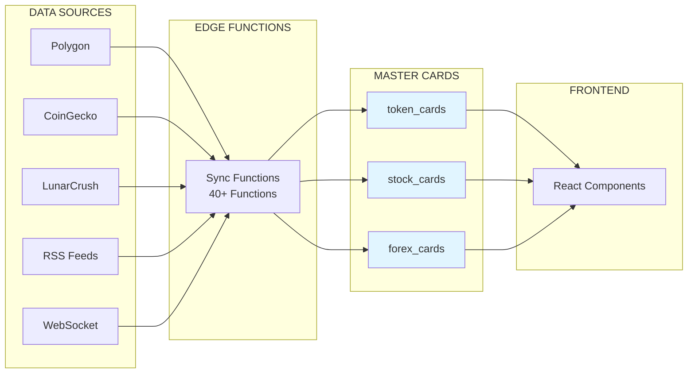
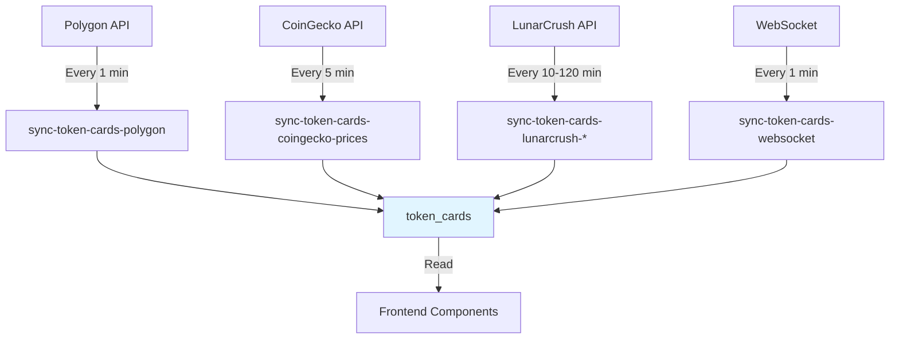
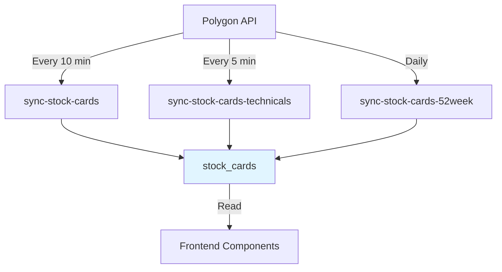
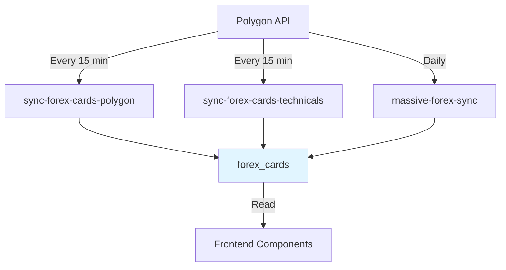

# XRayCrypto System Architecture - Mermaid Diagram

This file contains the complete Mermaid diagram for the XRayCrypto system architecture.

## Usage

Copy the Mermaid code below and paste it into any Mermaid-compatible viewer:
- GitHub/GitLab markdown (renders automatically)
- [Mermaid Live Editor](https://mermaid.live)
- VS Code with Mermaid extension
- Documentation tools (Docusaurus, MkDocs, etc.)

---

## Complete System Architecture Diagram

```mermaid
graph TB
    subgraph "EXTERNAL DATA SOURCES"
        POLYGON[Polygon.io<br/>Prices, OHLCV, Technicals<br/>Stocks, Forex, News]
        COINGECKO[CoinGecko API<br/>Prices, Market Cap, Supply<br/>Metadata, Contracts, Technicals]
        LUNARCRUSH[LunarCrush API<br/>Social Metrics, Sentiment<br/>AI Summaries, Topics, News]
        RSS[RSS Feeds<br/>22+ Feeds<br/>Crypto, Stock, Trump News]
        WEBSOCKET[Cloudflare Worker<br/>WebSocket Prices<br/>Real-time Updates]
    end

    subgraph "EDGE FUNCTIONS - TOKEN CARDS"
        TF1[sync-token-cards-polygon<br/>Every 1 min]
        TF2[sync-token-cards-websocket<br/>Every 1 min]
        TF3[sync-token-cards-coingecko-prices<br/>Every 5 min]
        TF4[sync-token-cards-coingecko-technicals<br/>4x daily]
        TF5[sync-token-cards-coingecko<br/>Daily 2:05 AM]
        TF6[sync-token-cards-coingecko-contracts<br/>Daily 6:35 AM]
        TF7[sync-token-cards-metadata<br/>Daily 6:20 AM]
        TF8[sync-token-cards-lunarcrush-tier1<br/>Every 10 min]
        TF9[sync-token-cards-lunarcrush-tier2<br/>Every 30 min]
        TF10[sync-token-cards-lunarcrush-tier3<br/>Every 60 min]
        TF11[sync-token-cards-lunarcrush<br/>Every 2 hours]
        TF12[sync-token-cards-lunarcrush-enhanced<br/>Every 4 hours]
        TF13[sync-token-cards-lunarcrush-ai<br/>Every 2 hours]
        TF14[sync-polygon-crypto-technicals<br/>Every 3 min]
        TF15[sync-top500-technicals<br/>Every 30 min]
    end

    subgraph "EDGE FUNCTIONS - STOCK CARDS"
        SF1[sync-stock-cards<br/>Every 10 min]
        SF2[sync-stock-cards-technicals<br/>Every 5 min]
        SF3[sync-stock-cards-52week<br/>Daily 7:45 AM]
    end

    subgraph "EDGE FUNCTIONS - FOREX CARDS"
        FF1[sync-forex-cards-polygon<br/>Every 15 min]
        FF2[sync-forex-cards-technicals<br/>Every 15 min]
        FF3[massive-forex-sync<br/>Daily 3:25 AM]
    end

    subgraph "EDGE FUNCTIONS - NEWS"
        NF1[polygon-news-unified<br/>Every 15 min]
        NF2[news-fetch<br/>RSS Feeds]
        NF3[lunarcrush-news<br/>Every 30 min]
        NF4[get-cached-news<br/>Read-only Cache]
    end

    subgraph "SUPPORTING FUNCTIONS"
        SU1[polygon-stock-poller<br/>Every 5 min]
        SU2[polygon-stock-snapshot<br/>Every 5 min]
        SU3[polygon-company-prefetch<br/>Every 4 hours]
        SU4[exchange-data-aggregator<br/>Every 15 min]
        SU5[exchange-sync<br/>Every 6 hours]
        SU6[auto-map-polygon-tickers<br/>Daily 2:15 AM]
        SU7[auto-map-exchange-tickers<br/>Daily 2:30 AM]
        SU8[mark-polygon-tokens<br/>Daily 4:00 AM]
        SU9[sync-lunarcrush-topics<br/>Every 30 min]
        SU10[sync-lunarcrush-ai-top25<br/>Hourly]
    end

    subgraph "DATABASE - MASTER CARDS"
        TC[(token_cards<br/>Master Table)]
        SC[(stock_cards<br/>Master Table)]
        FC[(forex_cards<br/>Master Table)]
        CACHE[(cache_kv<br/>News Cache)]
        LIVE[(live_prices<br/>Intermediate)]
        COMPANY[(company_details<br/>Stock Metadata)]
    end

    subgraph "FRONTEND COMPONENTS"
        FE1[CryptoUniverseDetail<br/>Token Detail Page]
        FE2[Screener<br/>Token Screener]
        FE3[StockDetail<br/>Stock Detail Page]
        FE4[StockScreener<br/>Stock Screener]
        FE5[ForexDetail<br/>Forex Detail Page]
        FE6[ForexScreener<br/>Forex Screener]
        FE7[NewsSection<br/>News Feed]
        FE8[Markets<br/>Market Overview]
        FE9[Watchlist<br/>User Watchlist]
        FE10[Favorites<br/>User Favorites]
    end

    subgraph "FRONTEND HOOKS"
        HOOK1[useTokenCards<br/>Token Data Hook]
        HOOK2[useStockCards<br/>Stock Data Hook]
        HOOK3[useLivePrices<br/>Real-time Prices]
        HOOK4[useCentralizedPrices<br/>Price Aggregation]
    end

    %% Data Sources to Edge Functions
    POLYGON --> TF1
    POLYGON --> TF14
    POLYGON --> SF1
    POLYGON --> SF2
    POLYGON --> SF3
    POLYGON --> FF1
    POLYGON --> FF2
    POLYGON --> FF3
    POLYGON --> NF1
    POLYGON --> SU1
    POLYGON --> SU2
    POLYGON --> SU3

    COINGECKO --> TF3
    COINGECKO --> TF4
    COINGECKO --> TF5
    COINGECKO --> TF6
    COINGECKO --> TF7

    LUNARCRUSH --> TF8
    LUNARCRUSH --> TF9
    LUNARCRUSH --> TF10
    LUNARCRUSH --> TF11
    LUNARCRUSH --> TF12
    LUNARCRUSH --> NF3
    LUNARCRUSH --> SU9
    LUNARCRUSH --> SU10

    RSS --> NF2

    WEBSOCKET --> TF2

    %% Edge Functions to Database
    TF1 --> TC
    TF2 --> TC
    TF3 --> TC
    TF4 --> TC
    TF5 --> TC
    TF6 --> TC
    TF7 --> TC
    TF8 --> TC
    TF9 --> TC
    TF10 --> TC
    TF11 --> TC
    TF12 --> TC
    TF13 --> TC
    TF14 --> TC
    TF15 --> TC

    SF1 --> SC
    SF2 --> SC
    SF3 --> SC
    NF1 --> SC

    FF1 --> FC
    FF2 --> FC
    FF3 --> FC

    NF1 --> CACHE
    NF2 --> CACHE
    NF3 --> CACHE

    SU1 --> LIVE
    SU2 --> SC
    SU3 --> COMPANY
    SU4 --> LIVE

    %% Database to Frontend
    TC --> FE1
    TC --> FE2
    TC --> FE7
    TC --> FE8
    TC --> FE9
    TC --> FE10
    TC --> HOOK1

    SC --> FE3
    SC --> FE4
    SC --> FE7
    SC --> FE8
    SC --> FE9
    SC --> HOOK2

    FC --> FE5
    FC --> FE6
    FC --> FE8

    CACHE --> FE7
    CACHE --> NF4
    NF4 --> FE7

    LIVE --> HOOK3
    LIVE --> HOOK4

    %% Frontend Hooks to Components
    HOOK1 --> FE2
    HOOK1 --> FE8
    HOOK2 --> FE4
    HOOK3 --> FE1
    HOOK3 --> FE3
    HOOK4 --> FE8

    style TC fill:#e1f5ff
    style SC fill:#e1f5ff
    style FC fill:#e1f5ff
    style POLYGON fill:#fff4e6
    style COINGECKO fill:#fff4e6
    style LUNARCRUSH fill:#fff4e6
    style RSS fill:#fff4e6
    style WEBSOCKET fill:#fff4e6
```

---

## Simplified Data Flow Diagram

A simplified version showing just the high-level flow:

---

## Data Flow by Asset Type

### Token Cards Flow

### Stock Cards Flow

### Forex Cards Flow

---

**Note:** These diagrams are part of the complete XRayCrypto system architecture documentation. For detailed schedules, column mappings, and implementation details, see `SYSTEM_ARCHITECTURE.md`.
